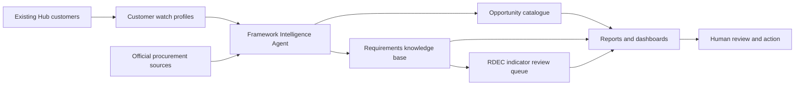

# Public Sector Framework Intelligence Agent - Design And Epics

Status: Approved for guarded MVP implementation  
Prepared for: Telent / M Group R&D Claim Evidence Hub  
Date: 2026-05-08  
Implementation status: Implemented as a local, manual-run, official-source guarded MVP on branch `codex/framework-intelligence-agent`  

This document proposes a new AI/MCP-driven section for the R&D Claim Evidence Hub. It is intended to help Telent / M Group track public-sector customer frameworks, procurement pipelines, tender opportunities, award notices, and emerging technical requirements, then turn that material into a searchable knowledge base and review-ready summary reports.

This is a business intelligence, bid-readiness, and evidence-support capability. It must not present itself as legal, tax, procurement, bid, or HMRC submission advice. Any RDEC-related output must remain caveated:

> Requires competent professional and tax review.

## Implementation Note

The first MVP implementation adds:

- `/framework-intelligence`
- `/framework-intelligence/source-catalogue`
- `/framework-intelligence/source-changes`
- `/framework-intelligence/portal-platforms`
- `/framework-intelligence/sources`
- `/framework-intelligence/watch-profiles`
- `/framework-intelligence/opportunities`
- `/framework-intelligence/opportunities/{id}`
- `/framework-intelligence/opportunities/{id}/documents`
- `/framework-intelligence/requirements`
- `/framework-intelligence/agent-runs`
- `/framework-intelligence/reports`

It stores official/public procurement source configuration, source-change snapshots, buyer portal platform metadata, customer watch profiles, captured opportunities, opportunity documents, extracted requirement themes, quality questions, RDEC candidate signals, agent run logs, audit events, and exportable Markdown intelligence reports. It also surfaces RDEC candidate review queues, opportunity workbench evidence gaps, and next-action prompts. It does not implement a continuous background crawler, customer contact automation, auto-bidding, or autonomous RDEC decisioning. Runs are explicit and guarded by an official/public HTTPS source allow-list.

## 1. Executive Summary

The proposed capability is a **Public Sector Framework Intelligence Agent**. It would use existing customer data in the Hub to monitor official procurement sources, classify relevant opportunities, extract customer requirements, and build a catalogue of public-sector technology, transport, operational, and framework needs.

The value is not simply "find tenders". The higher-value outcome is to create a structured, reusable knowledge base of what each public-sector customer is asking for over time:

- customer priorities
- framework structure
- technology direction
- operational constraints
- innovation themes
- security / resilience / service expectations
- procurement timelines
- likely bid opportunities
- R&D / RDEC candidate indicators
- evidence useful for future solution and claim scoping

The agent should support humans by watching official sources, summarising changes, and creating cited intelligence reports. It should not automatically bid, contact customers, claim eligibility, alter R&D rules, or make tax positions.

## 2. Current Official Source Landscape

The design is based on the current UK public procurement source landscape checked on 2026-05-08.

Primary official sources:

- [Find a Tender service](https://www.gov.uk/find-tender): used to search and apply for high-value contracts in the UK public and utilities sectors.
- [Contracts Finder](https://www.gov.uk/contracts-finder): used for public-sector contracts worth over GBP 12,000 including VAT with government and its agencies; high-value contracts are directed to Find a Tender.
- [Central Digital Platform factsheet](https://www.gov.uk/government/publications/procurement-act-2023-short-guides/central-digital-platform-factsheet-html): explains the enhanced Find a Tender service launched on 24 February 2025 as the central digital platform for public procurement.
- [Open Contracting on GOV.UK](https://www.gov.uk/government/publications/open-contracting): references public procurement data and Open Contracting Data Standard endpoints, including Find a Tender and Contracts Finder records.
- [Public-sector procurement guidance](https://www.gov.uk/guidance/public-sector-procurement): notes that Find a Tender works alongside Contracts Finder and devolved procurement portals such as Public Contracts Scotland, Sell2Wales, and eTendersNI.
- [Crown Commercial Service tender opportunity guidance](https://www.crowncommercial.gov.uk/start-supplying/find-tender-opportunities): explains practical public-sector tender discovery routes and CCS framework access.

Important design implication:

The agent should prefer official, public sources first. Third-party tender aggregators can be added later only as secondary sources and must be labelled clearly as non-official.

## 3. Proposed App Section

Add a new top-level app section:

```text
/framework-intelligence
```

MVP pages:

| Page | Purpose |
| --- | --- |
| `/framework-intelligence` | Dashboard of tracked customers, sources, new opportunities, deadline risks, and requirement themes. |
| `/framework-intelligence/source-catalogue` | Review configured official/public procurement source catalogue metadata. |
| `/framework-intelligence/source-changes` | Review source snapshot changes and connector health. |
| `/framework-intelligence/portal-platforms` | Maintain portal platform families and buyer portal instances. |
| `/framework-intelligence/sources` | Configure official/public source references and source status. |
| `/framework-intelligence/watch-profiles` | Configure customer and business-unit watch rules, keywords, CPV codes, aliases, and domains. |
| `/framework-intelligence/opportunities` | Catalogue of notices, frameworks, pipeline entries, awards, and related procurement records. |
| `/framework-intelligence/opportunities/{id}` | Opportunity workbench for requirements, documents, quality questions, RDEC signals, evidence gaps, and next actions. |
| `/framework-intelligence/opportunities/{id}/documents` | Capture permitted document links, retrieval tasks, summaries, and pasted excerpts. |
| `/framework-intelligence/requirements` | Searchable extracted requirements and RDEC signal review queues grouped by customer, domain, theme, source, and confidence. |
| `/framework-intelligence/reports` | Generate and view intelligent summary reports. |
| `/framework-intelligence/agent-runs` | Audit trail of agent runs, source checks, extraction decisions, warnings, and human approvals. |

Future pages:

| Page | Purpose |
| --- | --- |
| `/framework-intelligence/customers/{id}` | Customer intelligence profile built from notices, requirements, and linked Hub records. |

Navigation label:

```text
Framework Intelligence
```

## 4. Core User Journeys

### Journey A - Configure Customer Watchlist

Business development, bid, or engineering users select existing Hub customers and create watch profiles.

Capture:

- customer
- business unit
- official buyer names / aliases
- Companies House number, where relevant
- Find a Tender search terms
- Contracts Finder search terms
- CPV codes
- transport domain
- keywords
- notice types
- contract value thresholds
- geographies
- source priority
- watch frequency
- human owner

Example:

Customer: `National Highways Limited`  
Business unit: `Highways`  
Keywords: `telecommunications`, `roadside`, `operational technology`, `CCTV`, `stopped vehicle detection`, `network services`, `SCADA`, `cyber security`, `resilience`, `NRTS`, `strategic road network`  

### Journey B - Agent Source Monitoring

The agent checks official sources and records:

- source URL
- search query
- run timestamp
- result count
- new notices
- changed notices
- removed/unreachable notices
- source status
- HTTP status
- content hash
- parsed notice identifiers
- confidence

The MVP should support manual "Run watch now" first. Scheduled runs can follow after guardrails and review workflow are accepted.

### Journey C - Opportunity Catalogue

The system stores official notices and framework records as structured opportunities.

The catalogue should show:

- opportunity title
- buyer / customer
- source
- notice identifier
- OCID, where available
- notice type
- procurement stage
- published date
- deadline
- estimated value
- contract/framework duration
- CPV codes
- location
- source URL
- linked customer
- linked business unit
- relevance score
- status: `new`, `watching`, `bid_review`, `archived`, `rejected`

### Journey D - Requirements Knowledge Base

The agent extracts requirement statements from notices and documents, then stores them as cited knowledge items.

Requirement examples:

- real-time operational performance
- safety criticality
- cyber security
- legacy integration
- OT / IoT environment
- high availability
- service transition
- resilience
- obsolescence management
- innovation expectations
- data quality
- performance reporting
- asset management
- sustainability
- social value
- security accreditation
- service management

Each extracted requirement must include:

- source notice/document
- exact source reference
- short extracted requirement
- summary in plain English
- requirement type
- domain
- customer
- confidence
- extracted_at
- reviewed_by
- review status

### Journey E - Query And Reference

Users can query the knowledge base using filters and, later, natural language.

Example questions:

- "What are National Highways' recurring operational technology requirements?"
- "Which transport customers are asking for cyber resilience and high availability?"
- "What frameworks mention SCADA, IoT, telemetry, CCTV, or roadside equipment?"
- "Which upcoming opportunities look relevant to Highways?"
- "What customer requirements may indicate R&D candidate areas?"
- "Which requirements should inform our next solution intake?"

Every answer must cite source records and distinguish:

- directly sourced fact
- model summary
- inferred theme
- RDEC candidate indicator requiring review

### Journey F - Intelligent Summary Reports

Users generate reports for a customer, business unit, source, or period.

Report types:

1. **Customer Requirements Intelligence Report**
   - customer overview
   - current frameworks and opportunities
   - recurring technical themes
   - procurement timelines
   - likely upcoming requirements
   - source references
   - recommended internal actions

2. **Business Unit Opportunity Report**
   - relevant opportunities by BU
   - deadline risk
   - framework fit
   - capability themes
   - customer concentration
   - suggested pursuit/review actions

3. **RDEC Indicator Report**
   - requirements that may involve scientific or technological uncertainty
   - possible future R&D candidate themes
   - evidence to capture if work proceeds
   - contractual/entitlement questions
   - caveat: Requires competent professional and tax review.

4. **Framework Watch Brief**
   - newly detected notices
   - changed notices
   - upcoming deadlines
   - buyer changes
   - high-level implications
   - human review queue

## 5. MCP Agent Concept

The proposed agent should be implemented as an orchestrated set of capabilities rather than one opaque "black box".

Suggested agent roles:

| Agent capability | Responsibility |
| --- | --- |
| Source Monitor | Query official procurement sources and detect new/changed records. |
| Notice Normaliser | Convert source-specific data into the Hub's common opportunity schema. |
| Customer Matcher | Link notices to existing Hub customers and business units using aliases and reviewable confidence. |
| Requirement Extractor | Extract technical, service, commercial, operational, and innovation requirements from notice text and documents. |
| RDEC Signal Analyst | Identify possible R&D candidate indicators without claiming eligibility. |
| Report Writer | Produce cited Markdown/HTML reports for human review. |
| Guardrail Reviewer | Enforce source, citation, confidence, and no-advice constraints before outputs are shown as intelligence. |

MCP usage should be explicit and controlled:

- MCP tools may fetch official public URLs.
- MCP tools may parse public data formats such as JSON, CSV, XML, HTML, and PDF.
- MCP tools may write only to the local app database.
- MCP tools must not submit bids, authenticate to customer portals, send emails, or alter external systems in the MVP.
- Any future authenticated connector must require explicit configuration, secrets management, and user approval.

## 6. Guardrails

### Source Guardrails

- Prefer official GOV.UK, Find a Tender, Contracts Finder, CCS, customer procurement pages, and devolved procurement portals.
- Label source type: `official`, `customer official`, `devolved official`, `internal`, `third-party`.
- Do not rely on third-party summaries without linking back to the official source.
- Store source URLs, retrieval timestamps, and content hashes.
- Keep source text excerpts short and copyright-safe.

### AI Output Guardrails

Every generated answer or report must separate:

- source facts
- extracted requirements
- model summaries
- inferred themes
- RDEC candidate indicators
- recommended human actions

The agent must not:

- say Telent / M Group should bid
- say a bid will win
- say a project is eligible for RDEC
- say a customer can or cannot claim
- provide legal, tax, procurement, or submission advice
- auto-create claim projects without human approval
- auto-update R&D scoring rules
- auto-submit anything to external systems

### RDEC Guardrails

RDEC-related outputs must use terms such as:

- R&D candidate indicator
- review required
- possible technical uncertainty
- evidence to capture
- entitlement question
- pending competent professional and tax review

Every RDEC section must include:

> Requires competent professional and tax review.

### Human Approval Gates

Human approval is required before:

- a source watch is activated for scheduled monitoring
- a notice is marked as relevant
- an extracted requirement becomes "reviewed"
- an RDEC indicator is linked to a solution or R&D project
- a report is shared externally
- any authenticated connector is enabled

## 7. Proposed Data Model

The MVP can use SQLite and SQLModel, consistent with the current app.

Suggested models:

### FrameworkSource

- id
- name
- source_type
- base_url
- query_url
- official
- active
- check_frequency
- last_checked_at
- last_status
- notes

### CustomerWatchProfile

- id
- customer_id
- business_unit_id
- owner
- buyer_aliases
- keywords
- cpv_codes
- domains
- minimum_value
- include_awards
- include_pipelines
- active
- review_notes

### FrameworkOpportunity

- id
- customer_id
- business_unit_id
- source_id
- title
- buyer_name
- notice_identifier
- ocid
- notice_type
- procurement_stage
- published_date
- deadline_date
- value_low
- value_high
- currency
- cpv_codes
- location
- source_url
- status
- relevance_score
- relevance_rationale
- content_hash
- created_at
- updated_at

### OpportunityDocument

- id
- opportunity_id
- document_type
- title
- source_url
- local_reference
- content_hash
- retrieved_at
- text_available
- notes

### ExtractedRequirement

- id
- opportunity_id
- customer_id
- source_document_id
- requirement_text
- requirement_summary
- requirement_type
- theme
- transport_domain
- confidence
- source_locator
- review_status
- reviewed_by
- reviewed_at

### RDECOpportunitySignal

- id
- opportunity_id
- requirement_id
- signal_type
- field_of_science_or_technology_hint
- possible_uncertainty
- possible_advance
- evidence_to_capture
- entitlement_question
- confidence
- review_status
- caveat

### FrameworkAgentRun

- id
- started_at
- completed_at
- actor
- run_type
- source_id
- watch_profile_id
- status
- records_seen
- records_created
- records_updated
- warnings
- errors
- summary

### IntelligenceReport

- id
- report_type
- title
- customer_id
- business_unit_id
- generated_at
- generated_by
- markdown
- source_count
- caveat
- review_status

## 8. MVP Architecture

Recommended MVP architecture:



The first version should be intentionally simple:

- manual run button
- official source configuration
- source result storage
- dedupe by source identifier / OCID / URL hash
- customer matching
- requirement extraction
- report generation
- audit logging
- human review states

Scheduled autonomous monitoring should come after the manual-run flow is proven.

## 9. Fit With Current Hub

This capability complements the existing R&D Claim Evidence Hub:

| Current Hub | Framework Intelligence extension |
| --- | --- |
| Captures customers | Uses customers to build watch profiles. |
| Captures contracts/SOWs | Finds public notices and framework records that may later become contracts/SOWs. |
| Captures solution intake | Feeds customer requirements into future solution scoping. |
| Captures R&D projects | Highlights possible R&D candidate themes before delivery begins. |
| Captures evidence | Stores public procurement records as entitlement/context evidence. |
| Generates claim packs | Adds market/customer requirement context and RDEC indicator reports. |
| Knowledge Agent tracks HMRC guidance | Framework Intelligence Agent tracks customer procurement and requirement signals. |

## 10. Business Value Assessment

This likely adds real value if Telent / M Group wants the Hub to become more than a retrospective evidence store.

Expected benefits:

- earlier visibility of relevant public-sector opportunities
- better strategic understanding of customer requirements
- stronger bid/no-bid preparation
- reduced manual searching across procurement portals
- reusable customer requirement profiles
- improved solution intake quality
- earlier R&D candidate spotting
- better evidence of whether technical uncertainty was contemplated in procurement material
- better context for contracted-out / customer intent review
- more useful handover to Finance and Ayming where public-sector entitlement is relevant

The RDEC value is indirect but important:

- It can flag where procurement language suggests innovation, technical uncertainty, development, enhancement, resilience, obsolescence, or non-standard integration.
- It can preserve contemporaneous public-source evidence about the customer's requirements.
- It can help distinguish customer-contemplated R&D from supplier-discovered uncertainty.
- It can tell delivery teams what evidence to capture if a bid turns into work involving R&D candidate activity.

## 11. Key Risks

| Risk | Mitigation |
| --- | --- |
| Agent creates false confidence | Use confidence scores, source citations, and human review states. |
| Procurement source changes | Keep source connectors versioned and visible in agent-run logs. |
| Third-party source contamination | Prefer official sources and label non-official sources clearly. |
| Over-automation | Manual runs first; scheduled monitoring only after approval. |
| RDEC overclaiming | Use candidate wording and require competent professional/tax review. |
| Copyright / document reuse | Store metadata, short excerpts, hashes, and source links; avoid copying full tender packs unless permitted. |
| Secrets / portal access | MVP uses public sources only; authenticated connectors are future work. |
| Data governance | Mark MVP as not suitable for live sensitive evidence without SSO, RBAC, retention, backups, and deployment controls. |

## 12. Epic Plan

### Epic 1 - Discovery And Governance Foundation

Goal:
Define source policy, guardrails, and data governance before live monitoring.

Deliverables:

- source allowlist
- source type taxonomy
- AI output guardrails
- report caveats
- human approval states
- audit-event coverage
- updated documentation

Acceptance criteria:

- Official source policy is documented.
- Outputs distinguish sourced facts, summaries, inferences, and RDEC indicators.
- RDEC wording uses candidate/review-required language only.
- No external submissions or authenticated actions are possible.

### Epic 2 - Data Model And UI Shell

Goal:
Add the Framework Intelligence section and storage models without source fetching yet.

Deliverables:

- `/framework-intelligence` dashboard shell
- source registry screen
- customer watch profile screen
- opportunity catalogue screen
- requirements knowledge base screen
- agent-runs screen
- report screen

Acceptance criteria:

- Users can create watch profiles from existing customers.
- Users can add official source configurations.
- Empty-state UI explains that this is intelligence support, not procurement advice.
- Audit events are created for watch profile and source changes.

### Epic 3 - Official Source Connectors

Goal:
Implement manual source checks for official public procurement sources.

Initial source priority:

1. Find a Tender / Central Digital Platform public notices.
2. Contracts Finder.
3. CCS framework/opportunity pages where practical.
4. Customer official procurement pages.
5. Devolved portals as separate follow-on connectors.

Deliverables:

- manual "Run watch now"
- query builder from customer watch profiles
- source status recording
- notice ingestion
- dedupe logic
- source URL and content hash storage

Acceptance criteria:

- Manual run can fetch and store public-source notice metadata.
- Duplicate notices are not recreated.
- Source failures are visible.
- No secrets or cloud services are required.

### Epic 4 - Customer Matching And Relevance Scoring

Goal:
Link notices to customers and business units with reviewable confidence.

Deliverables:

- customer alias matching
- keyword and CPV matching
- buyer-name matching
- relevance score and rationale
- review states

Acceptance criteria:

- A notice can be linked to an existing customer.
- Low-confidence matches are marked `review_required`.
- Human users can confirm or reject matches.
- Relevance logic is explainable.

### Epic 5 - Requirement Extraction Knowledge Base

Goal:
Extract structured requirements from notice text and documents.

Deliverables:

- requirement extraction pipeline
- requirement themes
- source citations
- confidence scoring
- human review workflow
- requirement search/filtering

Acceptance criteria:

- Requirements include source references.
- AI summaries are separated from source text.
- Human reviewers can approve, challenge, or reject extracted requirements.
- Requirements can be filtered by customer, BU, source, theme, and domain.

### Epic 6 - RDEC Indicator Analysis

Goal:
Identify possible R&D candidate indicators from public procurement requirements.

Deliverables:

- RDEC signal extraction
- possible uncertainty fields
- possible advance fields
- evidence-to-capture recommendations
- entitlement question prompts
- link from requirement to solution intake

Acceptance criteria:

- Outputs use `R&D candidate indicator`, `review required`, and `Requires competent professional and tax review`.
- The system does not create claim projects automatically.
- Human approval is required before linking an indicator to a solution or project.
- Reports explain why the signal may matter for future evidence capture.

### Epic 7 - Intelligent Reports

Goal:
Generate cited, exportable reports for BD, engineering, Finance, and Ayming context.

Deliverables:

- Customer Requirements Intelligence Report
- Business Unit Opportunity Report
- RDEC Indicator Report
- Framework Watch Brief
- Markdown export
- HTML preview

Acceptance criteria:

- Reports include source list, generated timestamp, caveats, and confidence notes.
- Reports distinguish facts from model interpretation.
- RDEC sections include the required caveat.
- Reports can be regenerated without changing underlying reviewed data.

### Epic 8 - Autonomous Monitoring With Human Review

Goal:
Add scheduled monitoring only after manual runs are proven.

Deliverables:

- local scheduled run option
- run history
- notification queue inside the app
- new/changed/deadline alert panels
- pause/resume watch profiles

Acceptance criteria:

- A user must explicitly enable a watch profile.
- Runs are auditable.
- Failures are visible.
- No external notifications are sent without separate approval.
- The app remains Docker Desktop friendly.

### Epic 9 - Future Enterprise Integrations

Goal:
Prepare for production-grade usage after MVP validation.

Future integrations:

- Microsoft Entra ID / SSO
- RBAC
- SharePoint
- Teams
- Dynamics / CRM
- Jira
- Azure DevOps
- ServiceNow
- PSA / timesheets
- ERP / finance
- advisor review workflow
- immutable audit log
- Postgres and Alembic
- PDF exports

Acceptance criteria:

- Not part of MVP implementation.
- Each integration has a separate security and data-governance review.
- Secrets are never committed.

## 13. Recommended MVP Build Sequence

Recommended implementation order if approved:

1. Add models and UI shell.
2. Add source registry and customer watch profiles.
3. Add manual official-source ingestion for Find a Tender and Contracts Finder.
4. Add opportunity catalogue and dedupe.
5. Add requirement extraction with citations and review states.
6. Add RDEC indicator analysis with guardrails.
7. Add report generation.
8. Add tests and documentation.
9. Consider scheduled monitoring only after manual flow acceptance.

## 14. Approval Questions

Before implementation, decide:

1. Should the MVP monitor only official public sources, or also customer procurement pages?
2. Which customers should be first pilot watch profiles?
3. Which business units should receive the first dashboard: Highways, Rail, SCADA, TfL, Network Services, HPC, Nuclear Power, or Core Central Asset Management?
4. Should the first agent run be manual-only?
5. What keywords and CPV codes should be used for Telent / M Group services?
6. Should RDEC signals be shown to all users or only engineering/Finance reviewers?
7. Should reports be internal-only until reviewed?
8. Is Markdown export enough for MVP, or is PDF required later?

## 15. Recommendation

This feature appears to add real value if implemented with strong guardrails and a manual-review-first approach.

Recommended decision:

Approve a limited MVP for:

- official public-source monitoring
- customer watch profiles
- opportunity catalogue
- requirement knowledge base
- cited summary reports
- RDEC candidate indicator prompts
- human review and audit trail

Do not approve, at MVP stage:

- automatic bid decisions
- external submissions
- authenticated portal access
- external notifications
- automatic creation of R&D claim projects
- automatic RDEC/tax conclusions
